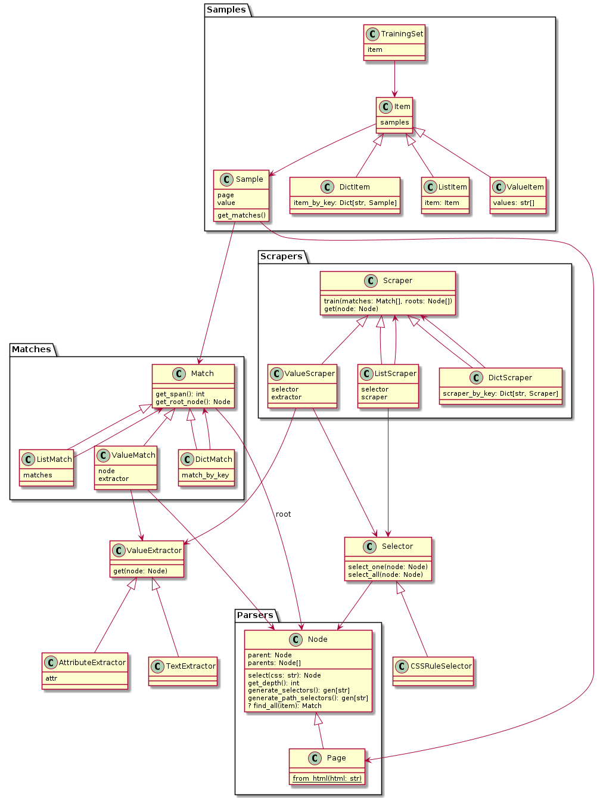

# mlscraper-experiment

Trying some ideas to extend my main library [mlscraper](https://github.com/lorey/mlscraper).

Features:

* scraping arbitrary items (dict, lists, list of dicts, etc.)
* smart scraper selection

## Structure
This class diagram shows the basic relationships.

## Terminology
* Scraper: turn a page into an item by scraping HTML
* Sample: One item on a page (to be scraped later), i.e. what the user inputs
* Match: One possible occurrence of a sample, i.e. nodes in which the sample occurs
* Extractor: get the value out of a DOM node
* Selector: an algorithm to select nodes